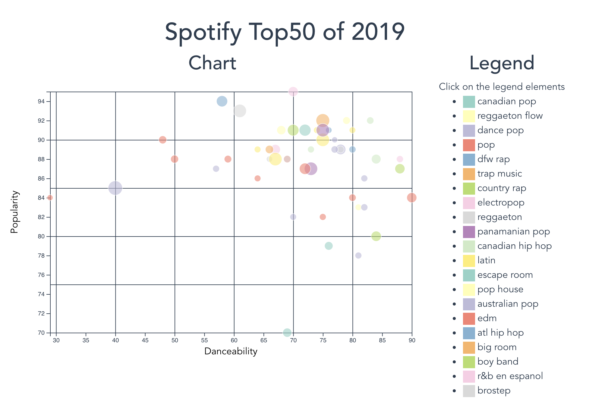

# Responsive Bubble chart with Vue.js and D3.js

## Data Visualization



## Project setup
```
npm install
```

### Compiles and hot-reloads for development
```
npm run serve
```

### Compiles and minifies for production
```
npm run build
```

## License
[MIT](http://github.com/adelshb/vue-d3/blob/master/LICENSE)
